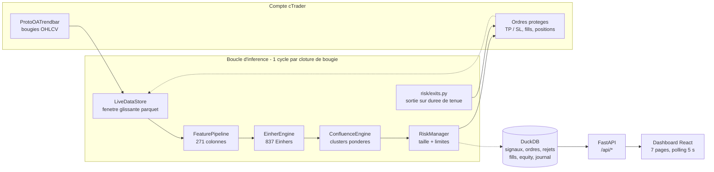

<div align="center">

# EINHERJAR

**Système de trading algorithmique autonome : 837 règles issues de la recherche, évaluées en continu sur un compte cTrader, exécutées sans intervention 24 h/24.**


</div>

EINHERJAR prend un corpus de règles de trading validées hors ligne et le fait tourner en production : chaque clôture de bougie, les 837 Einhers sont réévalués sur les features calculées à cet instant, les signaux qui se recoupent sont agrégés en clusters pondérés par la confiance, et chaque cluster passe ou non le filtre du gestionnaire de risque avant d'atteindre le broker.
Les données **et** l'exécution viennent du compte cTrader : il n'existe aucun mode de rejeu local en production, et `main.py` refuse de démarrer sans broker connecté.
Un dashboard React (7 pages, thème sombre « Valhalla ») rend l'état du système observable en temps réel — positions, signaux, courbe d'equity, journal, santé du broker.

> [!NOTE]
> Les résultats présentés dans ce README sont mesurés, pas estimés : ils proviennent du corpus livré (`outputs/corpus.jsonl`), des rapports de comparaison de features (`outputs/manifests/`) et d'une session réelle sur un compte **démo** cTrader. Aucun capital réel n'est engagé.

---

## Sommaire

- [Aperçu](#aperçu)
- [Architecture](#architecture)
- [Le corpus d'Einher](#le-corpus-deinher)
- [Comment ça marche](#comment-ça-marche)
- [Installation](#installation)
- [Configuration](#configuration)
- [Lancer le système](#lancer-le-système)
- [API](#api)
- [Dashboard](#dashboard)
- [Tests](#tests)
- [Déploiement sur Render](#déploiement-sur-render)
- [Limites connues et sécurité](#limites-connues-et-sécurité)
- [Licence](#licence)

---

## Aperçu

- **Un corpus, pas des prédictions en ligne** — 837 Einhers admis par la recherche, couvrant 28 actifs, 5 timeframes (5m, 15m, 1h, 4h, 1d) et 69 couples (actif, timeframe). Les conditions utilisent 83 features distinctes.
- **Features identiques à MIDAS** — 271 colonnes calculées à chaque cycle, dont 268 colonnes numériques comparées aux enrichisseurs MIDAS originaux : **268/268 identiques, écart relatif maximum 0,0** (BTCUSD 15m/1h/4h, NVDA 1d).
- **Cycle rapide** — amorçage historique ~16 s, échauffement JIT Numba 87–95 s **une seule fois**, puis cycles de ~0,5 s à chaud.
- **Le risque avant le signal** — toute position part avec un TP et un SL, la taille dérive du risque fixe (1 % de l'equity × confiance du cluster) rapporté à la distance au stop, puis 9 limites globales s'appliquent.
- **Tout est traçable** — signaux, ordres, rejets, fills, courbe d'equity et journal sont persistés en DuckDB et exposés par l'API ; un kill switch coupe les nouvelles exécutions sans toucher aux positions ouvertes.

---

## Architecture

Un seul flux, du broker au broker : la bougie entre, le signal sort, et l'ordre revient par le même adaptateur.



Le calcul de features est **ciblé** : chaque couple (actif, timeframe) ne paie que les colonnes réellement référencées par les conditions des Einhers de ce couple (`required_features_by_universe`), et l'univers est filtré deux fois — par le corpus, puis par la liste de symboles que le broker sert réellement.

### Modules

| Module | Rôle | Points clés |
|---|---|---|
| `main.py` | Point d'entrée unique | Vérifie les composants (`StatusChecker`), se connecte au broker, lance l'API FastAPI **et** la boucle d'inférence. Sans compte cTrader connecté : arrêt immédiat (code 2) |
| `src/einherjar/signals/` | Features et évaluation | `feature_pipeline.py` (271 colonnes), `corpus_bridge.py` (JSONL → Einhers évaluables), `einher_engine.py` (évaluation sur la dernière bougie), `technical_indicators.py` + `quantitative_features.py` + `numba_pattern_detectors.py` (~21 000 lignes reprises de MIDAS, dont 15 226 pour les détecteurs de patterns Numba) |
| `src/einherjar/core/` | Confluence et modèles | `confluence.py` (agrégation en clusters pondérés), `models.py`, `enums.py`, `config.py` |
| `src/einherjar/risk/` | Dimensionnement et limites | `manager.py` (risque fixe × confiance, plafonds globaux), `exits.py` (sortie sur durée de tenue) |
| `src/einherjar/brokers/` | cTrader + robustesse | `ctrader_adapter.py` (Open API sur Twisted, dans un thread dédié), `broker_utils.py` (mapping des symboles par broker, timestamps, frais), `resilience.py` (circuit breaker, rate limiter) |
| `src/einherjar/data/` | Persistance | `live_store.py` (fenêtre glissante OHLCV en parquet), `store.py` (DuckDB : signaux, ordres, rejets, fills, equity, journal, état) |
| `src/einherjar/scheduler/` | Cycle de vie | `loop.py` : détection de clôture, amorçage, échauffement, évaluation, exécution, sorties |
| `src/einherjar/api/` | API et authentification | `server.py` (endpoints + service du dashboard construit), `auth.py` (page de connexion, cookie signé) |
| `src/einherjar/research/` | Moteur de recherche | `xgb_einhers/` (XGBoost, sous-groupes, event study, FDR de Benjamini-Hochberg, holdout) : c'est lui qui a produit le corpus, il tourne hors ligne |
| `dashboard/einherjar-ui/` | Interface | React + TypeScript + Vite + Tailwind, thème sombre « Valhalla » |

---

## Le corpus d'Einher

`outputs/corpus.jsonl` est **la source de vérité du live** : une ligne JSON par Einher admis par la recherche. Le système ne connaît rien d'autre.

| Mesure | Valeur |
|---|---|
| Einhers admis | **837** |
| Actifs distincts | **28** |
| Timeframes | **5** — 5m, 15m, 1h, 4h, 1d |
| Couples (actif, timeframe) | **69** |
| Features distinctes dans les conditions | **83** |
| Sens | **494** BUY, **343** SELL |
| Opérateurs utilisés | `>=`, `>`, `<`, `<=`, `==` |
| Nombre de conditions par Einher | 1 à plusieurs, arbre `AND` / `OR` |

Provenance : trois familles d'Einhers sortent du moteur de recherche — arbres de décision **XGBoost** (avec ou sans veto de branche), découverte de **sous-groupes**, et configurations consolidées issues d'**event study** / régimes.

### Anatomie d'un Einher

Extrait réel de `outputs/corpus.jsonl` (première ligne, valeurs arrondies à l'affichage) :

```json
{
  "id": "or_NVDA_1d_60d_954d6c",
  "condition_tree": {
    "op": "OR",
    "left":  { "feature_ref": "parabolic_sar", "operator": ">=", "value": 4.26380014 },
    "right": { "feature_ref": "atr_21",        "operator": "<",  "value": 0.0211679507 }
  },
  "direction": "BUY",
  "amplitude_bars": 60,
  "tp_pct": 0.2635616359616991,
  "sl_pct": 0.1581369815770195,
  "universe": {
    "asset": "NVDA",
    "asset_class": "stocks_tech",
    "timeframe": "1d",
    "horizon": "60d",
    "horizon_bars": 60
  },
  "metrics": {
    "n_trades": 15,
    "n_tp": 9,
    "n_sl": 3,
    "n_timeout": 3,
    "win_rate": 0.7333333333333333,
    "avg_net_return": 0.14031854286400544,
    "sharpe_ratio": 2.329304820267817,
    "max_drawdown": -0.15913698157701955,
    "profit_factor": 5.219478996469738,
    "alpha": 0.4186590653470139,
    "p_value": 0.0010364944900083106
  },
  "scope": "asset",
  "source": { "model": "or_regimes", "n_conditions": 2 }
}
```

| Champ | Rôle dans le live |
|---|---|
| `condition_tree` | L'arbre de conditions évalué sur la dernière bougie ; les `feature_ref` désignent des colonnes du pipeline |
| `direction` | `BUY` ou `SELL` — un Einher n'a jamais les deux sens |
| `tp_pct` / `sl_pct` | Distance au take-profit et au stop-loss, en pourcentage du prix d'entrée |
| `amplitude_bars` | Durée de tenue maximale : au-delà, la position est fermée par EINHERJAR (les TP/SL, eux, sont tenus par le broker) |
| `universe` | Le seul couple (actif, timeframe) où cet Einher a le droit de se déclencher |
| `metrics` | Statistiques de la recherche (win rate, Sharpe, alpha, p-value) — conservées pour l'audit, jamais utilisées pour décider en live |

---

## Comment ça marche

1. **Contrôle des composants** — `StatusChecker` vérifie la config, le corpus, DuckDB, le pipeline de features, le moteur d'Einhers, le RiskManager, le scheduler et l'API. Un composant manquant : sortie en code 1.
2. **Connexion au broker** — l'adaptateur cTrader s'authentifie (application puis compte), lit l'equity, le levier et la liste des symboles. Sans broker : **arrêt, code 2** — aucune donnée locale de secours.
3. **Filtrage de l'univers** — les couples (actif, timeframe) viennent du corpus ; les actifs absents chez le broker sont écartés automatiquement et journalisés. Mesure sur le compte démo : 830 symboles servis, 24 des 28 actifs négociables, soit 733 Einhers sur 837.
4. **Amorçage historique** — par couple, jusqu'à `max_lookback` (1500) bougies réelles sont chargées dans le `LiveDataStore` (un parquet par couple). Sans historique, toutes les features à fenêtre seraient `NaN` et aucun Einher ne pourrait se déclencher. Mesure : ~16 s pour 60 couples.
5. **Échauffement JIT** — le premier passage compile les noyaux Numba : 87–95 s, **une fois par process**, puis plus rien à payer.
6. **Attente de clôture** — le calendrier par classe d'actif (crypto 24/7, forex et métaux, actions et indices US) dit quels marchés sont ouverts ; le réveil est calé sur la prochaine clôture de bougie, plus une marge de sécurité.
7. **Évaluation** — à chaque clôture : bougies récentes récupérées, features recalculées pour les seules colonnes requises par le couple, puis les 837 Einhers sont évalués sur la dernière bougie. Ceux dont les conditions ne sont pas encore toutes vraies mais restent proches sont publiés comme *en formation* (visibles dans le dashboard).
8. **Confluence** — les signaux sont regroupés par (actif, direction) et fusionnés en clusters : prix pondérés par la confiance, score = confiance × (0,70 + 0,15 × diversité des domaines + 0,15 × accord entre Einhers). Un cluster long et un cluster short sur le même actif restent **deux intentions distinctes**, jamais une moyenne.
9. **Gestion du risque** — pour chaque cluster : `volume = (equity × 1 % × confiance) / distance_au_SL`, arrondi au lot du symbole et jamais augmenté. Mesure : un cluster de 2 Einhers donne 0,40 % de risque. Puis les plafonds s'appliquent — exposition totale 60 %, par actif 20 %, par classe 35 %, 15 positions maximum, 3 positions corrélées maximum, perte quotidienne 5 %, drawdown *soft* 15 % (tailles divisées par deux) et *hard* 25 %, perte hebdomadaire 10 %. Un rejet est enregistré avec son motif, jamais silencieux.
10. **Exécution** — l'ordre part avec TP **et** SL (sans stop-loss valide, la taille n'a plus de sens : le rejet est explicite), les prix sont arrondis aux décimales du symbole, et l'ordre traverse le circuit breaker et le rate limiter. Vérifié de bout en bout sur le compte démo : ordre EURUSD de 38 000 unités, TP/SL transmis au broker puis relus **à l'identique**, position fermée proprement.
11. **Sorties** — les TP/SL sont tenus par le broker ; EINHERJAR ferme les positions dont la durée de tenue maximale (issue de `amplitude_bars`) est dépassée.
12. **Persistance et publication** — signaux, ordres, rejets, fills, courbe d'equity et état de la boucle sont écrits en DuckDB (écritures parquet throttlées, vidées à l'arrêt) ; l'API les expose et le dashboard les interroge toutes les 5 s.

> [!IMPORTANT]
> **Un seul adaptateur cTrader par process.** Le reactor Twisted est un singleton : deux adaptateurs dans le même process se font tomber l'un l'autre. `main.py` partage donc l'adaptateur du `StatusChecker` avec l'API (`utiliser_adapter`), au lieu d'ouvrir une seconde connexion.

---

## Installation

**Prérequis**

- Python **3.11+**
- Node.js 18+ et npm (uniquement pour construire le dashboard)
- Un compte cTrader **démo** (ou live), chez un broker supporté par l'Open API
- Une application Open API approuvée (`client_id` / `client_secret`) — le flux complet est décrit dans [`docs/GUIDE_CTRADER_DEMO.md`](docs/GUIDE_CTRADER_DEMO.md)

```bash
git clone https://github.com/keisary/einherjar.git
cd einherjar

# Environnement Python
python -m venv .venv
source .venv/Scripts/activate        # Windows (Git Bash) — macOS/Linux : source .venv/bin/activate

# Coeur du système (le paquet déclare ses dépendances dans pyproject.toml)
pip install -e .

# Librairie broker : indispensable pour le live, absente des extras par défaut
pip install ctrader-open-api

# Dashboard (produit dashboard/einherjar-ui/dist/, servi par FastAPI)
cd dashboard/einherjar-ui && npm install && npm run build && cd ../..

# Vérification de l'environnement broker
python scripts/ctrader_comptes.py            # liste les comptes autorisés par le token
python scripts/ctrader_verifier_univers.py   # actifs du corpus négociables chez le broker
```

> [!WARNING]
> `ctrader-open-api` épingle `protobuf==3.20.1`. Dans un environnement qui contient déjà `onnx` ou `streamlit`, installez-le dans un **venv dédié** plutôt que de casser la résolution de protobuf du projet.

Sans `ctrader-open-api`, le reste du système reste utilisable (pipeline de features, corpus, tests, dashboard) mais `CTraderAdapter` lève une erreur explicite au lieu de se comporter comme un broker.

---

## Configuration

### Authentification de l'application

L'application entière est protégée par une page de connexion. Les identifiants viennent de l'environnement — aucun mot de passe n'est codé en dur :

| Variable | Rôle | Comportement si absente |
|---|---|---|
| `EINHERJAR_AUTH_USERNAME` | Identifiant de connexion | `einherjar` par défaut |
| `EINHERJAR_AUTH_PASSWORD` | Mot de passe | Mot de passe aléatoire généré et **affiché une fois dans les logs** : l'application n'est donc jamais ouverte par défaut |
| `EINHERJAR_AUTH_SECRET` | Clé de signature des sessions | Dérivée du mot de passe — changer le mot de passe invalide toutes les sessions ouvertes |

Session : cookie `HttpOnly`, `SameSite=Lax`, `Secure` dès que la requête arrive en HTTPS, durée 12 h ; comparaison à temps constant et maximum 5 tentatives par adresse IP sur 5 minutes. Seuls `/login`, `/logout`, `/favicon.ico` et la sonde publique `/healthz` échappent à l'authentification.

### Identifiants cTrader

Deux sources possibles, l'**environnement est prioritaire** (un fichier oublié sur le
disque ne peut donc pas écraser la configuration de production) :

| Variable | Champ équivalent | Rôle |
|---|---|---|
| `EINHERJAR_CLIENT_ID` | `client_id` | Application Open API |
| `EINHERJAR_CLIENT_SECRET` | `client_secret` | Application Open API |
| `EINHERJAR_ACCESS_TOKEN` | `access_token` | Token OAuth du compte |
| `EINHERJAR_ACCOUNT_ID` | `account_id` | `ctidTraderAccountId` (voir ci-dessous) |
| `EINHERJAR_ENVIRONMENT` | `environment` | `demo` (défaut) ou `live` |
| `EINHERJAR_HOST` / `EINHERJAR_PORT` | `host` / `port` | Déduits de `environment` si absents |
| `EINHERJAR_BROKER_NAME` | `broker_name` | Mapping des symboles |

### `config/credentials.json`

Non versionné (voir `.gitignore`), utile en local. Modèle : `config/credentials.example.json`.

| Champ | Description |
|---|---|
| `environment` | `"demo"` ou `"live"` — pilote l'hôte, l'API et le code sont identiques dans les deux cas |
| `host` | `demo.ctraderapi.com` ou `live.ctraderapi.com` |
| `port` | `5035` pour les deux |
| `account_id` | **`ctidTraderAccountId` de l'Open API — ce n'est PAS le numéro de compte affiché par le broker.** `scripts/ctrader_comptes.py` donne la valeur à recopier |
| `client_id` / `client_secret` | Application Open API (même application que celle du token) |
| `access_token` | Token OAuth du compte ; rafraîchi à ~30 jours (`grant_type=refresh_token`, le refresh token n'expire pas) |
| `broker_name` | Nom du broker, utilisé pour le mapping des symboles (ex. `ic_markets`) |

### `config/settings.json`

| Clé | Valeur | Effet |
|---|---|---|
| `risk_per_trade` | `0.01` | Risque nominal par position : 1 % de l'equity plafonnée, multiplié par la confiance du cluster |
| `confidence_thresholds` | `[0.5, 0.75, 1.0]` | Seuils de confiance du dimensionnement |
| `timeframes` | `["5m","15m","1h","4h","1d"]` | Timeframes autorisés (croisés avec le corpus) |
| `risk_limits.exposure_total_pct` | `0.60` | Exposition totale maximale |
| `risk_limits.exposure_asset_pct` | `0.20` | Exposition maximale par actif |
| `risk_limits.exposure_class_pct` | `0.35` | Exposition maximale par classe d'actif |
| `risk_limits.max_positions` | `15` | Nombre de positions ouvertes simultanées |
| `risk_limits.max_correlated` | `3` | Positions corrélées simultanées |
| `risk_limits.daily_loss_pct` | `0.05` | Perte quotidienne : arrêt des nouvelles entrées |
| `risk_limits.drawdown_soft_pct` | `0.15` | Drawdown au-delà duquel les tailles sont divisées par deux |
| `risk_limits.drawdown_hard_pct` | `0.25` | Drawdown au-delà duquel plus rien n'est ouvert |
| `risk_limits.weekly_loss_pct` | `0.10` | Perte hebdomadaire maximale |

---

## Lancer le système

```bash
python main.py
```

Séquence attendue :

```text
[INIT] Verification des composants...
============================================================
  EINHERJAR  --  Systeme de Trading Algorithmique
  Valhalla Protocol v2.0  (cTrader Cloud)
============================================================
  [  OK  ] CONFIG               | OK
  [  OK  ] CORPUS               | OK (837 einhers)
  [  OK  ] DATABASE             | OK
  [  OK  ] FEATURE_ENGINE       | OK
  [  OK  ] EINHER_ENGINE        | OK
  [  OK  ] RISK_MANAGER         | OK
  [  OK  ] SCHEDULER            | OK
  [  OK  ] API_SERVER           | OK
  [  OK  ] CTRADER              | OK [demo] | Equity=$25,000.00 | Leverage=200x
============================================================
  API REST    : http://localhost:8000
  Health      : http://localhost:8000/api/health
  Account     : http://localhost:8000/api/account
  Dashboard   : http://localhost:3166  (Vite dev)
```

Le dashboard construit (`dashboard/einherjar-ui/dist/`) est servi par la même application FastAPI : il est donc aussi accessible sur `http://localhost:8000` dès que le build existe.

Puis, dans les logs : corpus chargé → univers broker vérifié → amorçage historique (~16 s) → échauffement JIT (87–95 s) → `Cycle ... | assets= | signals= | orders= | closed= | errors=0`.

Codes de sortie de `main.py` : `1` = composant défaillant, `2` = aucun broker cTrader connecté.

| Mode | Commande | Usage |
|---|---|---|
| Tout-en-un | `python main.py` | API + dashboard + boucle d'inférence (écoute `0.0.0.0:8000`) |
| API seule | `PYTHONPATH=src python -m uvicorn einherjar.api.server:app --port 8000` | Développement du dashboard, API sans boucle |
| Dashboard en dev | `cd dashboard/einherjar-ui && npm run dev` | Vite sur le port 3166, rechargement à chaud, API sur 8000 |

---

## API

FastAPI, servie par le même process que la boucle. **Tous les endpoints `/api/*` exigent une session valide** et renvoient `401 {"detail": "authentification requise"}` sinon.

| Méthode | Endpoint | Contenu |
|---|---|---|
| `GET` | `/healthz` | Sonde publique de la plateforme — aucune donnée de compte |
| `GET` | `/login` | Page de connexion (redirige si la session est déjà valide) |
| `POST` | `/login` | Vérifie les identifiants, pose le cookie signé |
| `GET` | `/logout` | Efface la session |
| `GET` | `/api/health` | État réel des dépendances : broker (`connected`, `host`, `circuitState`, `lastError`), environnement, corpus |
| `GET` | `/api/account` | Balance, equity, marge utilisée et libre, levier, `accountId` — jamais de valeur inventée : `{"connected": false}` si le broker est absent |
| `GET` | `/api/overview` | Cartes du bandeau (equity, variation, positions ouvertes, Einhers suivis), courbe d'equity, exposition par classe d'actif |
| `GET` | `/api/positions` | Positions persistées les plus récentes |
| `GET` | `/api/forming` | Derniers signaux bruts (actif, timeframe, sens, Einher, confiance, exécuté ou non) |
| `GET` | `/api/performance` | Einhers du corpus enrichis des statistiques runtime ; filtres `asset`, `timeframe`, `asset_class`, `direction`, tri `sort`, pagination `limit` / `offset` |
| `GET` | `/api/journal` | Journal des ordres, rejets et fills |
| `POST` | `/api/kill_switch` | Active ou désactive la pause des nouvelles exécutions (`?enabled=true`) |
| `GET` | `/{path}` | Sert le dashboard React construit (routes non-API) |

---

## Dashboard

React 18 + TypeScript + Vite + Tailwind, thème sombre « Valhalla ». Les données sont interrogées toutes les 5 s ; au-delà de 30 s sans réponse, l'interface signale une donnée périmée plutôt que d'afficher un état figé.

| Page | Ce qu'elle montre |
|---|---|
| **Overview** | Equity, variation, positions ouvertes, Einhers suivis, courbe d'equity, exposition par classe d'actif |
| **Positions** | Positions ouvertes avec leur Einher d'origine et leurs protections |
| **Forming** | Signaux les plus récents : quels Einhers se déclenchent, à quelle confiance, exécutés ou non |
| **Performance** | Einhers du corpus, filtrables par actif / timeframe / classe / sens, triés (Sharpe, win rate, alpha…) |
| **Journal** | Ordres, rejets (avec motif) et fills |
| **Health** | Santé du broker, état du circuit breaker, état de la boucle (cycles, signaux, erreurs) |
| **Settings** | Environnement réellement utilisé (`DEMO` / `LIVE`), lecture seule des identifiants serveur, kill switch |

> [!NOTE]
> L'environnement affiché vient de `config/credentials.json` côté serveur : aucun réglage du navigateur ne peut changer le mode de trading, et il n'existe pas de compte virtuel côté interface.

---

## Tests

Le dépôt contient deux suites : la chaîne live (`tests/`) et le moteur de recherche (`src/einherjar/research/tests/`, seule cible déclarée dans `pyproject.toml`).

```bash
# Chaine live : corpus, features, exécution, sorties, store
PYTHONPATH=src python -m pytest tests -q

# Moteur de recherche : XGBoost, sous-groupes, admission, holdout, baselines
PYTHONPATH=src python -m pytest -q
```

| Suite | Résultat mesuré |
|---|---|
| `PYTHONPATH=src python -m pytest tests -q` | **104 tests** collectés : **74 passés**, 1 module ignoré — `test_ctrader_live_chain.py` (30 tests) exige `ctrader-open-api` et est ignoré sinon |
| dont chaîne cTrader | **36 tests** : 30 sur la chaîne live + 6 sur la conversion des bougies cTrader |
| `PYTHONPATH=src python -m pytest -q` (moteur de recherche) | **199 tests** : 187 passés, 12 ignorés, en ~27 s |

Total : **303 tests** sur la branche courante, dont 30 qui ne s'exécutent qu'avec la librairie broker installée. Aucun test de la chaîne cTrader ne touche le réseau : le transport est remplacé par un client factice, le code testé reste le code réel. Les 30 tests de `test_ctrader_live_chain.py` verrouillent trois bugs constatés contre le compte démo — conversion des périodes (`ProtoOATrendbarPeriod` est une énumération, pas des minutes), champ `clientMsgId` inexistant sur les requêtes, et callbacks d'authentification qui acceptaient une réponse d'erreur comme une réussite.

---

## Déploiement sur Render

Un service web Python suffit : FastAPI sert l'API **et** le dashboard construit à partir du même process.

1. **Le dashboard déjà construit est versionné** (`dashboard/einherjar-ui/dist/`) : le déploiement n'a besoin ni de Node ni d'étape `npm`. Pour le régénérer après une modification du front :
   ```bash
   cd dashboard/einherjar-ui && npm ci && npm run build
   ```
2. **Créer un Web Service** sur Render, relié au dépôt, avec :
   - **Build Command** :
     ```bash
     pip install -r requirements.txt && pip install --no-deps -e . && pip install --no-deps ctrader-open-api==0.9.2
     ```
   - **Start Command** : `python main.py`
   - **Health Check Path** : `/healthz`
   - `ctrader-open-api` est installé **sans ses dépendances** : il épingle `protobuf==3.20.1`, dont il n'existe pas de roue pour Python 3.11, alors que ses modules générés fonctionnent avec le protobuf moderne fourni par `requirements.txt`.
3. **Version de Python** : `.python-version` (3.11.9) est lu par Render ; les roues `numpy 1.26` / `protobuf` utilisées n'existent pas pour 3.13.
4. **Variables d'environnement de l'application** : `EINHERJAR_AUTH_USERNAME`, `EINHERJAR_AUTH_PASSWORD`, `EINHERJAR_AUTH_SECRET` — sans mot de passe, l'application en génère un et l'écrit une fois dans les logs.
5. **Identifiants broker** : jamais dans le dépôt. Deux chemins, le second est celui utilisé en production :
   ```bash
   # a) fichier secret monte par la plateforme
   cp /etc/secrets/credentials.json config/credentials.json

   # b) variables d'environnement (prioritaires) — voir la section Configuration
   EINHERJAR_CLIENT_ID / EINHERJAR_CLIENT_SECRET / EINHERJAR_ACCESS_TOKEN / EINHERJAR_ACCOUNT_ID
   ```
5. **Données** : `data/` (DuckDB + parquet OHLCV live) vit sur le disque local du service. Sans disque persistant, un redéploiement repart d'un historique vide — le `LiveDataStore` se ré-amorce automatiquement depuis le broker (~16 s) mais la base DuckDB (journal, fills, equity) est perdue.

> [!NOTE]
> `main.py` écoute sur `0.0.0.0:$PORT` (variable d'environnement, `8000` par défaut) : la plateforme impose donc son port sans configuration. `main.py` reste le seul point d'entrée qui démarre la boucle d'inférence. Un service = un process = un seul adaptateur cTrader (contrainte du reactor Twisted).

---

## Limites connues et sécurité

**Limites techniques**

- **Un seul adaptateur cTrader par process** : le reactor Twisted est un singleton. Deux adaptateurs dans le même process se font tomber l'un l'autre.
- **Base d'API du dashboard** : `dashboard/einherjar-ui/src/hooks/useData.ts` utilise une base **relative** (`/api`), surchargeable par `VITE_API_BASE` à la construction. Le même build fonctionne donc en local comme derrière un domaine, sans recompilation.
- **`account_id` ≠ numéro de compte du broker** : c'est le `ctidTraderAccountId` de l'Open API. Une valeur erronée donne un compte non autorisé, pas une erreur explicite — d'où `scripts/ctrader_comptes.py`.
- **Reconstruction des bougies** : dans `ProtoOATrendbar`, seul `low` est un prix absolu (en points, 1 point = 1/100000) ; `open`, `high`, `close` sont des deltas **relatifs au low de la même bougie** et ne se chaînent pas d'une bougie à l'autre.
- **Prix et protections** : tout ordre part avec un TP et un SL, arrondis aux décimales du symbole, faute de quoi le broker refuse l'ordre ; la taille n'est jamais augmentée par le dimensionnement.
- **Levier** : fixé par le broker (200:1 sur le compte démo utilisé), lu par l'API et jamais modifiable par le code — c'est le RiskManager qui dose le volume.
- **Fenêtre d'historique** : le `LiveDataStore` est dimensionné sur le `max_lookback` du pipeline (1500 bougies) ; une fenêtre plus courte dégraderait silencieusement les features à fenêtre. La couverture des features est vérifiée au démarrage et les couples incomplets sont écartés avec log.
- **Arrêt du process** : les TP/SL restent chez le broker (les positions restent protégées), mais la fermeture sur durée de tenue n'est plus appliquée tant qu'EINHERJAR ne tourne pas.

**Sécurité**

- Page de connexion obligatoire, cookie signé `HMAC-SHA256`, `HttpOnly` + `SameSite=Lax` (+ `Secure` en HTTPS), comparaison à temps constant, limitation des tentatives par IP.
- `config/credentials.json`, les `.env` et les bases locales sont exclus du dépôt (`.gitignore`). Aucun secret n'est journalisé — seul un mot de passe **généré** est affiché une fois, pour permettre la première connexion.
- `POST /api/kill_switch` coupe les nouvelles exécutions sans fermer les positions en cours.
- Le token Open API expire (~30 jours) et se rafraîchit par `refresh_token` ; un compte créé après l'autorisation doit être ré-autorisé.

> [!CAUTION]
> Ce système passe des ordres réels sur le compte configuré et reste un projet de recherche en cours de validation : il tourne sur un compte **démo**. Câblez d'abord un compte démo, surveillez le journal et les rejets, et n'engagez aucun capital que vous n'êtes pas prêt à perdre. Les performances historiques du corpus ne préjugent en rien des résultats futurs.

---

## Licence

Aucun fichier `LICENSE` n'est versionné à ce jour : le code est publié à titre de démonstration technique et reste, par défaut, sous droit d'auteur de son auteur (aucune licence explicite n'accorde de droit de réutilisation, de modification ou de redistribution). Ouvrez une *issue* pour toute question d'usage.

<div align="center">
<sub>EINHERJAR — « les guerriers d'Odin ». Thème Valhalla, de la recherche au broker.</sub>
</div>
